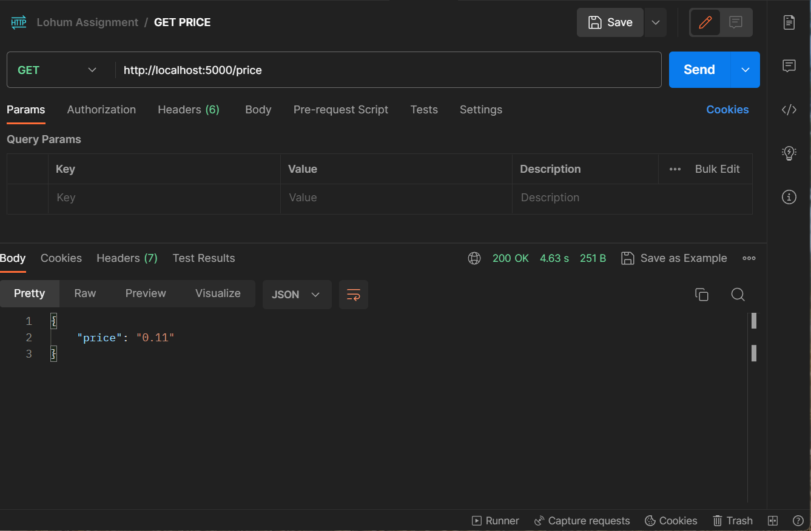

# Get Price Project (Lohum)
### Question : 
    Create a RestFul API that returns the price mentioned on this website - [link](https://www.metal.com/Lithium-ion-Battery/202303240001)

    - The API can be using any framework of your choice e.g. Flask, Nodejs
    - The API would be have endpoint `GET /price`
    - Every time the API is hit, you should scrape this [webpage](https://www.metal.com/Lithium-ion-Battery/202303240001), and get the latest price
    - The API should return error message, for invalid calls
    - Once, this solution is developed, host it in a free platform of your choice like Heroku, Netlify, etc
    - Upload your source code in Github or any other VCS
    - Add a README file in Github detailing relevant information which I need to know about your project

### Answer :
    - I have used NodeJs for making above project and fulfill the requirements
    - I have used express framework
    - I have used Libraries axios for making HTTP request on this website - [link](https://www.metal.com/Lithium-ion-Battery/202303240001)
    I have used cheerio for scrapping the website - [link](https://www.metal.com/Lithium-ion-Battery/202303240001)

    Now, I have created index.js which is my project startup file.
    I have created API with the endpoint ```GET``` /price and to achive above target I have created 
    controller with the name getPrice and scrapWebAndGetPrice() method to scrap given website - [link](https://www.metal.com/Lithium-ion-Battery/202303240001).

### Screenshots : 
